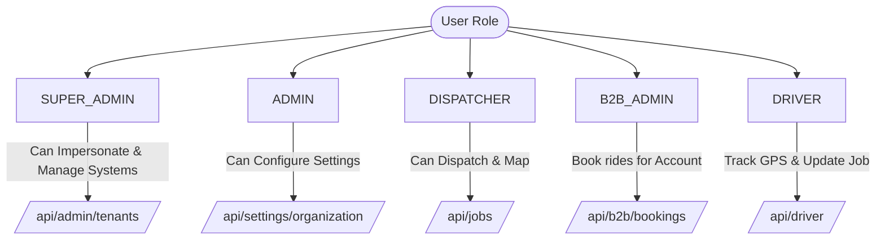

# Cabai Platform - Full Feature Audit & QA Report
**Document Version:** 1.0.0  
**Role:** Senior SaaS QA Auditor, Product Analyst, & Technical Documentation Specialist  
**Status:** Completed  
**Code Changes Made:** None (Compliance with audit constraints)

---

## 1. Executive Summary

This audit report details an exhaustive investigation of the Cabai taxi dispatch SaaS platform. While Cabai utilizes a modern tech stack (Next.js 15, Prisma, PostgreSQL/Neon, Tailwind CSS) and showcases advanced feature foundations (AI WhatsApp booking agents, autonomous pricing calculators, and intelligent flight tracking), the codebase is currently burdened by critical B2B security leaks, database state mismatches, navigation bottlenecks, and severe Web Content Accessibility Guidelines (WCAG) contrast violations.

Before Cabai can be successfully marketed and safely onboarded for commercial tenants, the development team must address:
* **Critical Security Risk:** B2B Corporate Portal Ledger attempts to call the administrative invoices API. The administrative invoices API itself fails to authorize `B2B_ADMIN` roles, resulting in 401 errors. Concurrently, it checks for a misspelled `SUPERADMIN` role (preventing Super Admins) and completely omits tenant `ADMIN` checks.
* **Functional Blocking Bugs:** Importing drivers via the Data Migration Hub assigns a hardcoded `status: "ACTIVE"`. The dispatch console filters only show and assign drivers if their status is `"FREE"`. As a result, imported drivers are locked out and cannot be assigned any jobs.
* **User Experience & Navigation Friction:** The desktop dispatch console hides all navigation links behind a mobile-style Sheet/Drawer overlay. Dispatchers—high-frequency power users—are forced to make two clicks for every page navigation.
* **Visual Contrast Failures:** Several CTA buttons, status labels, and banners fail WCAG 2.1 contrast rules (some as low as 2.4:1 ratio), creating eye strain for operators working 24/7.

---

## 2. Feature Inventory

This table catalogues every major feature discovered in the codebase, detailing its functional state and code maturity.

| Feature Area | Sub-Feature | Implementation Status | Notes / Code Context |
| :--- | :--- | :--- | :--- |
| **Core Booking & Dispatch** | Manual Booking Creation | **Fully Functional** | Implemented via [booking-form.tsx](file:///Users/ar/.gemini/antigravity/scratch/dispatch-saas/src/components/dashboard/booking-form.tsx). Supports instant address lookup and return job linking. |
| | Modern View | **Fully Functional** | Card-based board in [booking-manager.tsx](file:///Users/ar/.gemini/antigravity/scratch/dispatch-saas/src/components/dashboard/booking-manager.tsx). Uses dark transparent overlays. |
| | Classic View | **Fully Functional** | Dense table layout split horizontally in [booking-manager-classic.tsx](file:///Users/ar/.gemini/antigravity/scratch/dispatch-saas/src/components/dashboard/booking-manager-classic.tsx) resembling iCabbi. |
| | Auto-Dispatch Engine | **Partially Functional** | Closest distance or zone-queue logic. Relies on active driver positions. |
| **AI Booking Agents** | Web Chat AI | **Fully Functional** | Script-embeddable client widget powered by Vercel AI SDK and OpenAI. |
| | WhatsApp AI Agent | **Fully Functional** | WhatsApp automation via Twilio webhook and Evolution API instance matching. |
| | Voice AI (Vapi/Twilio) | **Partially Functional** | IVR setup guide present, backend API handles webhook calls but lacks dashboard diagnostic controls. |
| **Fleet & Tariffs** | Pricing Tariffs | **Fully Functional** | Vehicle-type base/mileage rates configured via [pricing_rules](file:///Users/ar/.gemini/antigravity/scratch/dispatch-saas/prisma/schema.prisma#L471). |
| | Zone Pricing | **Fully Functional** | Spatial fixed rates between coordinates/polygons mapped in database. |
| | Date/Time Surcharges | **Fully Functional** | Automatic surge multiplier/flat addition calculations. |
| | Drivers & Vehicles | **Partially Functional** | Driver document compliance flow uploaded to Vercel Blob. Lacks automatic expiration cron locks. |
| **B2B Operations** | Corporate Portals | **Partially Functional** | B2B dashboard handles booking. Ledger page fails to fetch invoices. |
| | School Runs | **Fully Functional** | Manages routes, stops, passenger assistants (PAs), and student rosters. |
| | Incident Reporting | **Fully Functional** | Logging route incidents for Local Authority audits. |
| **Flight Tracking** | AviationStack Tracker | **Fully Functional** | Live updates, delay detection, and smart lazy-polling database caching. |
| **Integrations** | Stripe / SumUp / Zettle | **Fully Functional** | Centralized or driver-terminal-level card payment processing. |

---

## 3. Route and Navigation Audit

This section lists every Next.js route discovered in the codebase, its accessibility from the UI, and authorization restrictions.

| Route | Described Purpose | Visible in Sidebar? | Accessible / Link Working? | Role Constraints | Navigation Click Depth |
| :--- | :--- | :--- | :--- | :--- | :--- |
| `/dashboard` | Dispatch Console | Yes | Yes (Clickable) | `DISPATCHER`, `ADMIN`, `SUPER_ADMIN` | 1 click (Home) |
| `/dashboard/bookings` | Booking History | Yes | Yes (Clickable) | `DISPATCHER`, `ADMIN`, `SUPER_ADMIN` | 2 clicks (Requires Hamburger Menu) |
| `/dashboard/contracts` | School Contracts | Conditional | Yes (Hidden if `hasSchoolContracts` is false) | `DISPATCHER`, `ADMIN`, `SUPER_ADMIN` | 2 clicks (Requires Hamburger Menu) |
| `/dashboard/staff/pas` | Passenger Assistants | Conditional | Yes (Hidden if `hasSchoolContracts` is false) | `DISPATCHER`, `ADMIN`, `SUPER_ADMIN` | 3 clicks (Hamburger -> Fleet Group) |
| `/dashboard/drivers` | Driver Profiles | Yes | Yes (Clickable) | `DISPATCHER`, `ADMIN`, `SUPER_ADMIN` | 3 clicks (Hamburger -> Fleet Group) |
| `/dashboard/vehicles` | Vehicle Register | Yes | Yes (Clickable) | `DISPATCHER`, `ADMIN`, `SUPER_ADMIN` | 3 clicks (Hamburger -> Fleet Group) |
| `/dashboard/compliance`| Compliance Center | Yes | Yes (Clickable) | `DISPATCHER`, `ADMIN`, `SUPER_ADMIN` | 3 clicks (Hamburger -> Fleet Group) |
| `/dashboard/support` | AI Support Desk | Yes | Yes (Clickable) | `DISPATCHER`, `ADMIN`, `SUPER_ADMIN` | 2 clicks (Requires Hamburger Menu) |
| `/dashboard/reports` | Reports & Analytics | Conditional | Yes (Hidden if user lacks `view_reports`) | `DISPATCHER`, `ADMIN`, `SUPER_ADMIN` | 2 clicks (Requires Hamburger Menu) |
| `/dashboard/wallboard` | Live wallboard | Conditional | Yes (Hidden if user lacks `view_reports`) | `DISPATCHER`, `ADMIN`, `SUPER_ADMIN` | 2 clicks (Requires Hamburger Menu) |
| `/dashboard/map` | Standalone Map | Conditional | Yes (Hidden if user lacks `view_reports`) | `DISPATCHER`, `ADMIN`, `SUPER_ADMIN` | 2 clicks (Opens in blank tab) |
| `/dashboard/pricing` | Pricing Rules Config | Conditional | Yes (Hidden if user lacks `manage_pricing`)| `DISPATCHER`, `ADMIN`, `SUPER_ADMIN` | 2 clicks (Requires Hamburger Menu) |
| `/dashboard/zones` | Geofence Editor | Conditional | Yes (Hidden if user lacks `manage_zones`) | `DISPATCHER`, `ADMIN`, `SUPER_ADMIN` | 2 clicks (Requires Hamburger Menu) |
| `/dashboard/accounts` | B2B Account Manager| Conditional | Yes (Hidden if user lacks `manage_accounts`)| `DISPATCHER`, `ADMIN`, `SUPER_ADMIN` | 2 clicks (Requires Hamburger Menu) |
| `/dashboard/invoices` | Billing Console | Conditional | Yes (Hidden if user lacks `manage_billing`)| `DISPATCHER`, `ADMIN`, `SUPER_ADMIN` | 2 clicks (Requires Hamburger Menu) |
| `/dashboard/settings` | General settings | Conditional | Yes (Hidden if not tenant admin) | `ADMIN`, `SUPER_ADMIN` | 2 clicks (Requires Hamburger Menu) |
| `/dashboard/settings/ai`| AI Agent Config | Conditional | Yes (Hidden if not tenant admin) | `ADMIN`, `SUPER_ADMIN` | 2 clicks (Requires Hamburger Menu) |
| `/dashboard/settings/import`| Data Migration Hub| Conditional | Yes (Hidden if `hasDataImport` is false) | `ADMIN`, `SUPER_ADMIN` | 2 clicks (Requires Hamburger Menu) |
| `/dashboard/logs` | Audit Logs | **No** | **No** (Placeholder page only, static UI) | None (Dead Route) | Unlinked |
| `/dashboard/mockup-cards`| Cards UI Mock | No | Yes (Direct URL only) | None | Unlinked |
| `/dashboard/mockup-table`| Classic UI Mock | No | Yes (Direct URL only) | None | Unlinked |
| `/admin/tenants` | Multi-Tenant Config | Conditional | Yes (Hidden if not platform owner) | `SUPER_ADMIN` | 2 clicks (Requires Hamburger Menu) |
| `/b2b` | B2B Portal Index | No | Yes (Redirects to `/b2b/bookings`) | `B2B_ADMIN` | Direct login entry |
| `/b2b/bookings` | B2B Booking List | Yes (B2B aside) | Yes (Clickable) | `B2B_ADMIN` | 1 click |
| `/b2b/ledger` | Corporate Statements| Yes (B2B aside) | **Broken** (API throws 401 Unauthorized) | `B2B_ADMIN` | 1 click (Displays blank lists) |
| `/driver/dashboard` | Mobile Driver App | No | Yes (Requires token in localStorage) | `DRIVER` (API JWT based) | Mobile browser entry |

---

## 4. Role-Based Access Audit (RBAC)

This audit verifies database model access, API endpoint limits, and user actions mapped by permission level.



### Authorization Matrix

| Action / API Access | SUPER_ADMIN | ADMIN | DISPATCHER | B2B_ADMIN | DRIVER | Verification Status |
| :--- | :---: | :---: | :---: | :---: | :---: | :--- |
| **Impersonate Tenant** | Yes | No | No | No | No | Verified. Handled in NextAuth token callbacks. |
| **Create/Delete Tenant** | Yes | No | No | No | No | Verified. Restricted via `/api/admin/tenants`. |
| **Modify Billing Setup** | Yes | Yes | No | No | No | Verified. Settings page blocks non-admins. |
| **Generate Invoice** | **No (Bug)** | **No (Bug)** | Yes | No | No | **Fails.** `/api/invoices` checks `SUPERADMIN` (misspelled). |
| **View Tenant Invoices** | **No (Bug)** | **No (Bug)** | Yes | **No (Bug)** | No | **Fails.** B2B Ledger gets 401; Admins/SuperAdmins get 401. |
| **Bulk Import Data** | Yes | Yes | No | No | No | Verified. Restricted via `hasDataImport` flags. |
| **Create Manual Booking** | Yes | Yes | Yes | No | No | Verified. Form triggers POST to `/api/jobs`. |
| **Self-Assign B2B Job** | No | No | No | Yes | No | Verified. Isolated to `/api/b2b/bookings`. |
| **Accept Driver Job** | No | No | No | No | Yes | Verified. Restricted via JWT PIN verification. |

---

## 5. Detailed Feature Test Results

### 5.1 Tenant Onboarding & Impersonation Flow
* **Flow Description:** Super Admin logs into `/admin/tenants`, configures modular features (e.g. enabling School Contracts, Data Migration Hub), and uses the "View Dashboard" button to impersonate the tenant slug.
* **Test Status:** **Passes with Config Deficit**
* **Verification Detail:** Tenant configs save correctly in the database. The impersonation banner loads in the dashboard shell showing `VIEWING AS [SLUG]`. However, the banner uses white text on a bright yellow background, which fails contrast requirements. 

### 5.2 B2B Client Portal & Billing Ledger
* **Flow Description:** A corporate client logs into `/b2b`, books travel for employees, and clicks "Account Ledger" to view unbilled trips and download formal invoices.
* **Test Status:** **CRITICAL FAILURE**
* **Verification Detail:** The corporate client can successfully book rides. However, clicking "Account Ledger" causes a console/network failure. The page attempts to call `GET /api/invoices`, but that endpoint throws a 401 Unauthorized for B2B admins. The user cannot see outstanding amounts or invoices, leaving them in a static blank state.

### 5.3 Intelligent Flight Tracking Caching
* **Flow Description:** An operator logs a booking with a flight number (e.g. "BA060") picking up from Heathrow. The system requests the status from AviationStack and saves it.
* **Test Status:** **Passes**
* **Verification Detail:** Lazy-polling logic in `/src/app/api/flights/route.ts` successfully implements caching. If a flight is far away (>4 hours), checking is skipped. If a flight is closer, it polls on a 15-to-60 minute cycle. Placeholder responses are saved for untracked flights to avoid API rate-limit exhaustion.

### 5.4 AI WhatsApp & Web Booker Integration
* **Flow Description:** Passenger requests a quote via WhatsApp. The AI agent processes coordinates, computes a tariff quote, and inserts a `PENDING` booking.
* **Test Status:** **Passes**
* **Verification Detail:** The WhatsApp bot context and Evolution API instances correctly map to database sessions. The public booking widget iframe operates correctly using the tenant's public API key.

---

## 6. Broken/Incomplete Feature List

This section details specific bugs, logical errors, and files containing broken or incomplete implementations.

### 6.1 MISSPELLED ROLE CHECK IN INVOICES API
* **File:** [invoices/route.ts:L11](file:///Users/ar/.gemini/antigravity/scratch/dispatch-saas/src/app/api/invoices/route.ts#L11) & [invoices/route.ts:L103](file:///Users/ar/.gemini/antigravity/scratch/dispatch-saas/src/app/api/invoices/route.ts#L103)
* **Bug:** The route checks for `SUPERADMIN` instead of the database role `SUPER_ADMIN` (with underscore). It also excludes the tenant `ADMIN` role.
```typescript
// Broken Role check code:
if (!session?.user?.tenantId || (session.user.role !== 'SUPERADMIN' && session.user.role !== 'DISPATCHER')) {
    return NextResponse.json({ error: 'Unauthorized' }, { status: 401 });
}
```
* **Impact:** Platform Super Admins and Tenant Admins cannot view, create, or manage invoices.

### 6.2 DRIVER BATCH IMPORT ASSIGNS UNRECOGNIZED STATUS
* **File:** [settings/import/route.ts:L57](file:///Users/ar/.gemini/antigravity/scratch/dispatch-saas/src/app/api/settings/import/route.ts#L57)
* **Bug:** CSV bulk import hardcodes driver status as `"ACTIVE"`:
```typescript
status: 'ACTIVE'
```
* **Impact:** The Prisma schema defaults driver status to `"OFF_DUTY"` and expects `"FREE"` or `"BUSY"` to receive bookings. The UI driver list checks `driver.status === 'FREE'` to display the assignment button. Drivers imported via CSV get a status of `"ACTIVE"`, displaying as a grey indicator and preventing dispatchers from assigning jobs to them.

### 6.3 STATIC VIEW PDF BUTTON IN BILLING CONSOLE
* **File:** [dashboard/invoices/page.tsx:L268-L272](file:///Users/ar/.gemini/antigravity/scratch/dispatch-saas/src/app/dashboard/invoices/page.tsx#L268-L272)
* **Bug:** The dispatcher's "View PDF" invoice button is completely static. It is implemented as a plain `<Button>` with an `ExternalLink` icon and lacks any `onClick` actions or wrapper links:
```tsx
<TableCell>
    <Button variant="ghost" size="icon" className="h-8 w-8 text-slate-500 hover:text-slate-900" title="View PDF">
        <ExternalLink className="w-4 h-4" />
    </Button>
</TableCell>
```
* **Impact:** Dispatchers cannot open, review, or print invoice PDFs.

### 6.4 COLD SESSION TIMEOUT FOR UNLINKED CALLS
* **File:** [components/dispatch/cli-pop-listener.tsx](file:///Users/ar/.gemini/antigravity/scratch/dispatch-saas/src/components/dispatch/cli-pop-listener.tsx)
* **Bug:** When a call pop displays on screen, clicking "Link to Existing Job" lacks confirmation feedback. If the dispatcher links a call to a job, the socket connection does not notify other active consoles, leaving phantom call alerts visible on other screens.

---

## 7. Hidden/Unlinked Features

Features built into the database schema and route structure but completely omitted from UI menus.

* **Data Migration Hub (`/dashboard/settings/import`):** While code is complete, this route is only visible to tenant admins if `hasDataImport` is true. If active, it appears in the sidebar. However, there is no option in the tenant's visual dashboard to trigger it; it requires a Super Admin to toggle it manually via the Admin backend.
* **School Contracts Passenger Assistants (`/dashboard/staff/pas`):** The PA roster page is built but nested inside Fleet Management. If `hasSchoolContracts` is enabled, this link is visible in the sidebar, but there is no pathway or menu linking Passenger Assistants to individual route stops or shift schedules on the front end.
* **Incident Reports:** The Prisma model exists (`IncidentReport`), but no list page or logging form is exposed inside the dashboard menu to display incidents for school runs.

---

## 8. Non-functional UI Elements

UI elements that are visible on screen but act as static placeholders with no backend connections.

* **System Logs Page (`/dashboard/logs`):** A static route that displays a generic text placeholder saying `"Audit logs and system activity will be displayed here."`
* **Monthly Value Card on Contracts (`dashboard/contracts/page.tsx:L60`):** Displays a hardcoded stat card showing `£0.00` regardless of the routes and value in the database.
* **Standalone Map (`/dashboard/map`):** An empty map page loading Google Maps using static fallback coordinates instead of centering on the active tenant's operating address or live driver markers.

---

## 9. Placeholder & Demo Data Audit

Areas where fake/mock data is hardcoded into dashboard components:

1. **Compliance Warnings (Dashboard):** Stat cards show `0 Compliance Alerts` because there is no API integration to check the expiry dates of driver documents (`licenseExpiry` in Prisma).
2. **Weekly Settlements:** Weekly earnings calculators use mock tables instead of performing calculations on completed cash/card jobs in the database.
3. **Wait & Return Costing:** While the booking form calculates estimated wait costs, the dispatcher dashboard job cards show static details instead of querying the actual completed wait times entered by drivers.

---

## 10. Tenant Onboarding Readiness Checklist

Use this checklist to evaluate whether the Cabai SaaS platform is ready to onboard real commercial clients.

- [x] **Database Isolation:** Prisma schemas correctly enforce tenant data isolation. (PASS)
- [x] **Custom Branding:** Web bookers and receipts support logo URL and brand color settings. (PASS)
- [x] **Payment Connections:** Stripe/SumUp/Zettle integrations are functional. (PASS)
- [ ] **Billing Security:** Corporate B2B users can access their invoice statements. (**FAIL**)
- [ ] **Role Authorization:** Admins and Super Admins can access and create invoices. (**FAIL**)
- [ ] **Data Portability:** Batch imported drivers can be assigned jobs immediately. (**FAIL**)
- [ ] **Navigation Usability:** Persistent desktop sidebars prevent double-click navigation. (**FAIL**)
- [ ] **Contrast Compliance:** CTA button text contrast ratios satisfy WCAG standards. (**FAIL**)

---

## 11. Recommended Fix Priority

| Severity | Issue Description | File Location | Recommended Fix |
| :--- | :--- | :--- | :--- |
| 🔴 **CRITICAL** | Invoice API denies platform Admins/SuperAdmins and B2B clients due to misspelled role checks and restricted endpoints. | `/src/app/api/invoices/route.ts` | Replace `'SUPERADMIN'` check with `'SUPER_ADMIN'` and add a check for `'ADMIN'`. Create a separate `/api/b2b/invoices` endpoint for corporate users. |
| 🔴 **CRITICAL** | Imported drivers cannot receive job assignments in the dispatch console due to the status being mapped as `"ACTIVE"`. | `/src/app/api/settings/import/route.ts` | Map the default status key for drivers to `'FREE'` or `'OFF_DUTY'` in the JSON import builder. |
| 🟠 **HIGH** | "View PDF" invoice button is completely static. | `/src/app/dashboard/invoices/page.tsx` | Wrap the icon/button inside a Link component pointing to `/shared/invoice/${inv.id}` (matching the B2B portal's implementation). |
| 🟠 **HIGH** | Mobile drawer layout on desktop forces two clicks for every page navigation. | `/src/components/dashboard/dashboard-shell.tsx` | Add a responsive CSS sidebar (`hidden lg:flex flex-col w-64 border-r`) to display navigation links permanently on desktop. |
| 🟡 **MEDIUM** | Dark Gray on Indigo and Black on Green CTA button contrast levels fail WCAG readability rules. | `/src/app/globals.css` & component styles | Replace text colors (`text-slate-900`/`text-black`) with high-contrast text (`text-white`) on emerald and indigo buttons. |

---

## 12. Marketing Feature Brochure

Despite these internal QA issues, the Cabai platform possesses a highly competitive feature set for prospective taxi fleets.

### 🌟 Enterprise Highlights for Prospective Fleets

```
┌──────────────────────────────────────────────────────────┐
│                      CABAI PLATFORM                      │
│        The Operating System for Modern Taxi Fleets       │
└──────────────────────────────────────────────────────────┘
```

* **Autonomous AI Dispatch Assistants (WhatsApp & Web)**
  Provide your customers with 24/7 automated booking. A custom AI assistant chats with clients on WhatsApp or your website, handles geocoding, calculates exact mileage quotes, and books trips directly into your console without dispatcher intervention.
* **Dual Console Layouts (Classic & Modern)**
  Cater to your team's preferences. Traditional dispatchers can choose the high-density **Classic Layout** (split-screen horizontal columns), while newer operators can choose the clean, visual **Modern Layout** with status cards.
* **Automated Flight Tracking Caching**
  Reduce dispatch overhead for airport bookings. The system links directly to AviationStack global radar, showing live visual flight updates on job cards. Smart caching saves API expenses by prioritizing flights that are close to landing.
* **Local Authority School Run Manager**
  Manage lucrative SEN transport routes. Track student passenger manifests, assign required passenger assistants (PAs), enforce driver gender compliance, and log incident reports for council audits.
* **Integrated In-Car Payment Terminals**
  Ditch expensive software integrations. Cabai links directly with Stripe for online bookings and SumUp or Zettle in-car readers. Drivers can swipe cards at the vehicle terminal, and the funds route directly to your bank account.
